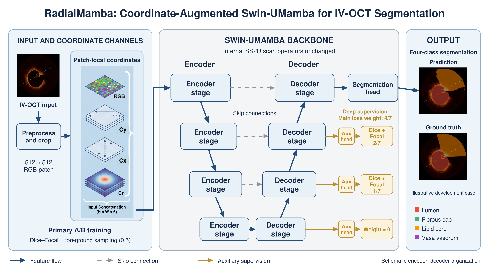

# RadialMamba

**Coordinate-augmented Swin-UMamba for multi-class IV-OCT segmentation**

RadialMamba studies the use of spatial coordinate channels in a shared segmentation network for **lumen, fibrous cap, lipid core, and vasa vasorum (VV)**. The implementation adds local `x`, `y`, and `r` channels to RGB patches and uses a Swin-UMamba backbone with its internal SS2D scan operators unchanged.



*Architecture overview. Coordinate maps refer to the current patch. The displayed IV-OCT prediction and reference are an illustrative development example, separate from the holdout results below. The stages show the encoder–decoder organization schematically.*

## Method

- **Input coordinates:** append normalized `x`, `y`, and radial distance `r` to the current RGB patch, giving six channels. In the code, `x` varies along height and `y` along width.
- **Shared backbone:** retain Swin-UMamba and SS2D. The added input channels do not introduce a new radial scan operator.
- **Training:** the primary coordinate comparison uses Dice–Focal loss and foreground oversampling in both arms. A separate refinement evaluates class weights and VV sampling jointly.

[Method details](docs/method.md) · [Data and splits](docs/data.md) · [Training and inference](docs/training_and_inference.md) · [Evaluation](docs/evaluation.md)

## Evaluation snapshot

The primary comparison uses the same-source holdout of **1,899 frames from 10 study IDs**, separate from 74 training and 19 inner-validation studies. Both arms share the primary training recipe. The inner-validation criterion selects the checkpoint independently for each arm.

| Class | A: with coordinates | B: without coordinates | Paired A−B | 95% interval |
| --- | ---: | ---: | ---: | --- |
| Lumen | 0.9741 | 0.9735 | +0.0006 | [−0.0007, 0.0021] |
| Fibrous cap | 0.3054 | 0.2747 | +0.0306 | [−0.0160, 0.0815] |
| Lipid core | 0.2586 | 0.2379 | +0.0207 | [−0.0372, 0.0782] |
| VV | 0.0375 | 0.0030 | +0.0398 | [−0.0071, 0.1042] |

Values are means of study-level Dice. The VV arm means include 8 and 7 studies respectively, and the paired contrast uses the 7 studies with a defined score in both arms. It therefore differs from subtracting the two displayed means.

The primary point estimates favor the coordinate arm, while the paired intervals include zero. An additional final-endpoint training comparison does not reproduce the advantage. These results support an exploratory assessment of coordinate augmentation. See [full results](docs/results.md) for probability metrics, VV recall and false positives, and the additional training comparison.

## What is included

| Location | Contents |
| --- | --- |
| [`src/`](src/README.md) | Coordinate module and the available trainer/loss source extracts |
| [`nnunetv2/`](nnunetv2/) | Overlay layout for coord + Revision A/B trainers (place on `PYTHONPATH`) |
| [`scripts/run/`](scripts/run/) | Published train/predict wrappers |
| [`configs/`](configs/README.md) | Verified primary recipe, run budget, and nnU-Net plans |
| [`splits/`](docs/data.md) | Frame-level train/validation list and study manifests |
| [`scripts/`](docs/evaluation.md) | Bundle verification and exact probability ROC/AP evaluation |
| [`results/`](results/README.md) | Recorded summary metrics, per-study counts, and evaluation records |
| [`reproducibility/`](reproducibility/README.md) | Checkpoint hashes, selection record, and export notes |
| [`upstream/`](upstream/README.md) | Unmodified Swin-UMamba stock (not the revision-modified net) |

**Snapshot scope (2026-10-09):** public project page with architecture figure, verified configs/splits/results, coordinate module, Revision A/B trainers, and analysis scripts. Also includes recovered training-era `coord_conv.py` / UMambaEnc-coord trainers from local editor history, plus **unmodified** upstream Swin-UMamba stock under [`upstream/`](upstream/README.md). The **training-modified** `SwinUMamba.py` (coordinate kwargs in `get_swin_umamba_from_plans`), VV dataloader, and oral launch scripts are **not** on this Mac until KEEP is remounted — see [`docs/MISSING_RUNTIME_FROM_KEEP.md`](docs/MISSING_RUNTIME_FROM_KEEP.md). Model weights, raw images, and per-pixel probability arrays are **not** published here (common practice; SHA256 of selected checkpoints is in `reproducibility/checkpoints.json`).

## Start here

From the repository root, check the split manifests and recorded Dice values without a GPU:

```bash
python3 scripts/verify_bundle.py
```

With PyTorch installed, run the coordinate-channel example:

```bash
python3 examples/coordinate_channels.py
```

For ROC/AP analysis of your own saved probability maps:

```bash
python3 -m pip install -r requirements-analysis.txt
python3 scripts/roc_pr_exact_from_npz.py --help
```

See the [environment record](docs/environment.md) and [run guide](docs/training_and_inference.md) before training or inference.

## Data

Obtain IV-OCT data from the [Danilov public dataset](https://zenodo.org/records/14478210). The repository provides split identifiers and aggregate evaluation records. The source data remain available through their original distribution.

## Acknowledgments

This work builds on [Swin-UMamba](https://github.com/JiarunLiu/Swin-UMamba), [U-Mamba](https://github.com/bowang-lab/U-Mamba), and [nnU-Net](https://github.com/MIC-DKFZ/nnUNet). We thank the authors of the backbone, training framework, and public IV-OCT dataset. See [source acknowledgments](THIRD_PARTY_NOTICES.md) and [citation information](CITATION.md).

## Contact

Chunliu He, Sanjiang University: [chunliu_he@163.com](mailto:chunliu_he@163.com).
