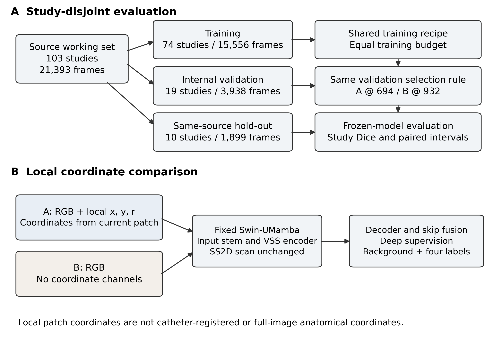

# Evaluation protocol



## Selection and holdout

Checkpoint candidates were the archived v1 snapshots near epoch 700 and the final epoch-932 snapshots. The selection criterion was the equal-weight mean of fibrous cap, lipid, and VV study-mean Dice on the 19-study inner-validation set. Each arm selected its own checkpoint using that same criterion. Lumen was reported separately.

The development-stage selection record was frozen before this holdout evaluation. It selects A at 694 and B at 932, rather than choosing a checkpoint based on the test-set A−B contrast. This was not a rule registered before training. The additional refinement and second endpoint pair remain separate analyses.

## Study-level Dice and paired intervals

For each class, sum TP, FP, and FN over all frames of each study and calculate:

$$Dice = 2TP / (2TP + FP + FN).$$

- Empty reference and empty prediction: the score is undefined and excluded from that arm's class mean.
- Empty reference with a nonempty prediction: Dice is 0 and remains in the mean.
- Paired contrasts: use studies with a defined score in both arms.

The recorded paired bootstrap resamples studies with all their frames together, uses 10,000 replicates and seed 20261005, and reports percentile 95% intervals. Studies are paired across arms. Frames and training runs are not additional independent patients.

VV has unequal arm-specific denominators. The primary paired contrast is conditional on the seven common score-defined studies. It omits an A-only false-positive study with an undefined B score, so it should be read alongside the arm means and false-positive counts. The contrast is not the subtraction of the separately averaged arm means.

[`../scripts/verify_bundle.py`](../scripts/verify_bundle.py) recomputes observed Dice values and paired point differences from the saved TP/FP/FN counts. It verifies the recorded intervals' table fields but does not regenerate bootstrap replicates. The original bootstrap scoring script remains to be added from the backup.

## VV reporting

Report positive-frame pooled Dice and recall separately from study-mean Dice. Also report false-positive frames and pixels on reference-negative frames. These quantities use different aggregation and must not be mixed in one contrast.

## Probability ROC and average precision

[`../scripts/roc_pr_exact_from_npz.py`](../scripts/roc_pr_exact_from_npz.py) computes class-wise pixel AUROC and AP from continuous float32 probability maps. It groups equal scores into distinct thresholds before integration. AUROC uses trapezoidal integration of the threshold ROC. AP uses the recall-increment weighted precision sum and differs from trapezoidal PR area.

PR plots include the positive-pixel prevalence baseline. These probability metrics pool pixels descriptively. This export does not report study-level uncertainty intervals for AUROC or AP. They are separate from the paired Dice analysis.

Before running the script, verify that both prediction directories contain the same expected cases, arrays use the five-class ordering, probabilities are finite and sum to approximately one along the class axis, and ground truth aligns with the prediction grid. Hard argmax masks do not supply threshold curves.

```bash
python3 scripts/roc_pr_exact_from_npz.py \
  --gt /path/to/labelsTs \
  --pred-a /path/to/A_probability_npz \
  --pred-b /path/to/B_probability_npz \
  --out-dir /path/to/metrics \
  --tag imagesTs_frozen_pair
```

The full holdout contains 1,068,187,500 pixels. Exact sorting of all pixels needs substantial CPU memory. The recorded script runs one class at a time. The original images and `.npz` files are not included in the repository.
