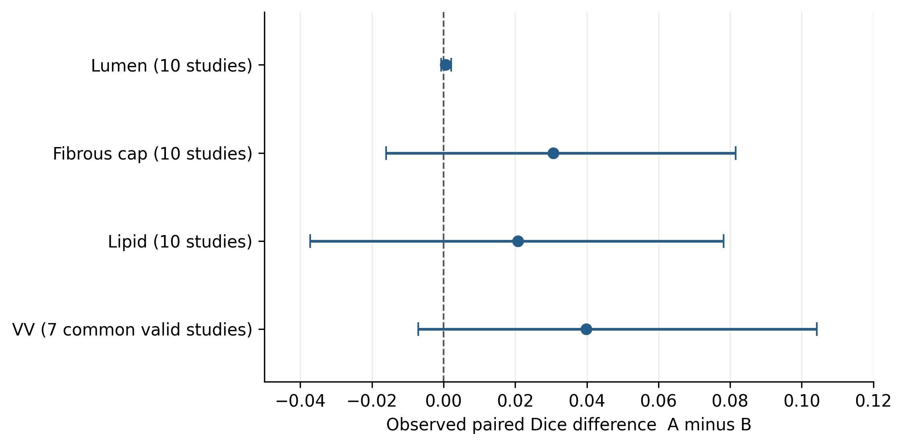
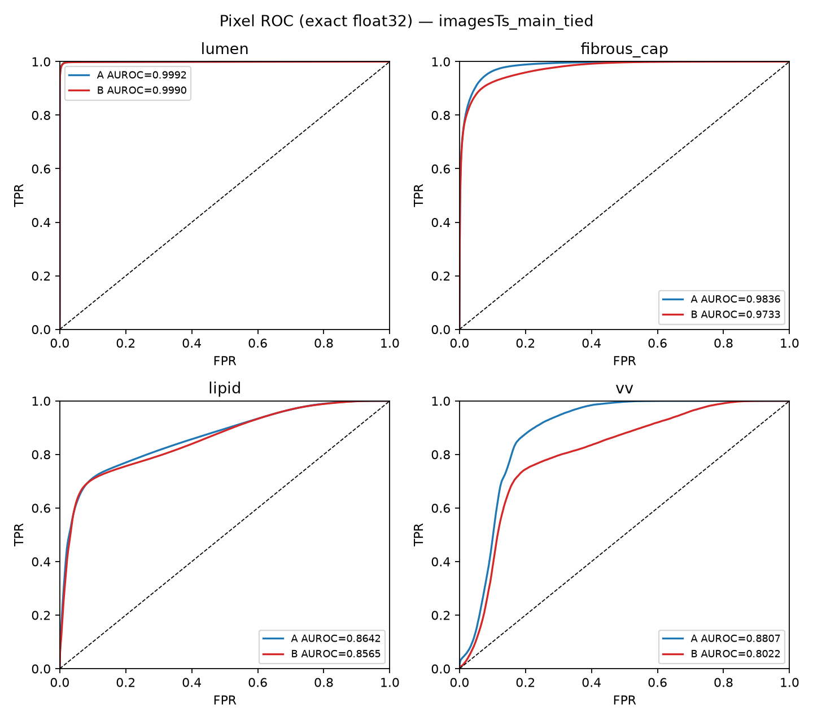
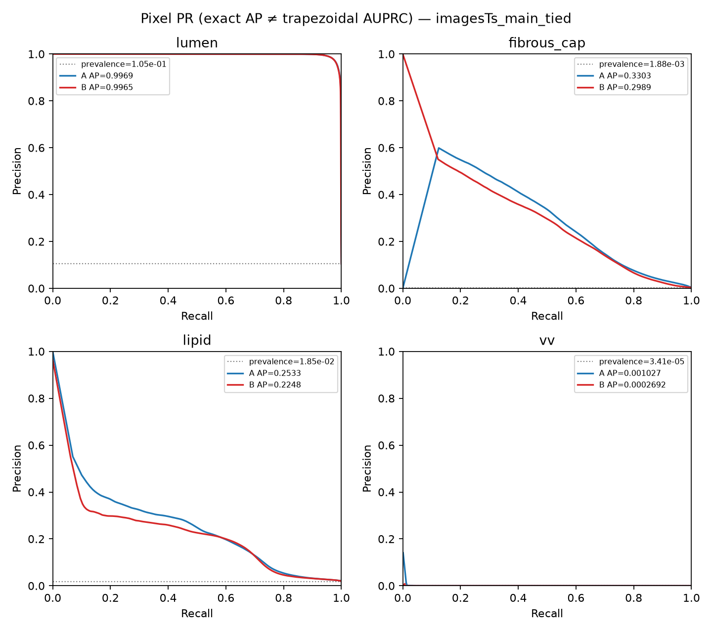

# Recorded results

The primary holdout comprises 1,899 frames from 10 source study IDs. A enables local coordinate channels. B uses RGB only. Both share the v1 primary recipe. A@694 and B@932 were selected independently using the same inner-validation criterion.

## Primary study-level Dice

| Class | A mean (n) | B mean (n) | Observed paired A−B | 95% interval |
| --- | ---: | ---: | ---: | --- |
| Lumen | 0.9741 (10) | 0.9735 (10) | +0.0006 | [-0.0007, 0.0021] |
| Fibrous cap | 0.3054 (10) | 0.2747 (10) | +0.0306 | [-0.0160, 0.0815] |
| Lipid core | 0.2586 (10) | 0.2379 (10) | +0.0207 | [-0.0372, 0.0782] |
| VV | 0.0375 (8) | 0.0030 (7) | +0.0398 | [-0.0071, 0.1042] |

The point estimates favor A, but all primary paired intervals include zero. The VV contrast uses seven common score-defined studies and differs from the difference of arm means. A-only false positives are retained in the arm-specific summaries and the negative-frame analysis below.

## VV positive and negative frames

| Metric | A | B |
| --- | ---: | ---: |
| Positive frames | 45 | 45 |
| Positive-frame pooled Dice | 0.0123 | 0.0044 |
| Positive-frame pixel recall | 0.0062 | 0.0022 |
| Negative frames | 1,854 | 1,854 |
| Negative frames with any false-positive pixels | 26 | 13 |
| False-positive pixels on negative frames | 5,046 | 4,207 |

The primary VV recall remains low, and A predicts more false positives on negative frames. These values describe research segmentation performance and do not establish clinical detection performance.

## Continuous probability metrics

| Class | A AUROC | B AUROC | A AP | B AP | Pixel prevalence |
| --- | ---: | ---: | ---: | ---: | ---: |
| Lumen | 0.999215 | 0.998981 | 0.99690821 | 0.99649131 | 0.10516609 |
| Fibrous cap | 0.983629 | 0.973288 | 0.33028450 | 0.29890865 | 0.0018791177 |
| Lipid core | 0.864228 | 0.856536 | 0.25327590 | 0.22476410 | 0.018477486 |
| VV | 0.880674 | 0.802180 | 0.00102741 | 0.00026922 | 3.4123223e-05 |

These metrics use all 1,068,187,500 holdout pixels with float32 score ties merged. AP is average precision, not trapezoidal AUPRC. The VV PR baseline is approximately 3.4123 × 10−5. A has higher descriptive probability metrics in this primary pair. No study-level AUROC/AP significance interval is provided. A high AUROC does not remove the low VV recall at the argmax decision rule.

## Additional comparisons

The 50-epoch joint refinement applies class weights and VV sampling to both arms. The second training pair uses final epoch-932 endpoints and does not repeat the primary checkpoint-selection policy. Seed 43 was set in the second pair's main process; augmentation-worker randomness was not fully controlled.

| Analysis / arm | Lumen | Fibrous cap | Lipid core | VV |
| --- | ---: | ---: | ---: | ---: |
| Joint refinement A | 0.9731 | 0.2968 | 0.2557 | 0.0269 |
| Joint refinement B | 0.9728 | 0.2688 | 0.2127 | 0.0299 |
| Second final endpoint A2 | 0.9729 | 0.2338 | 0.1546 | 0.0026 |
| Second final endpoint B2 | 0.9726 | 0.2532 | 0.2163 | 0.0639 |

The second endpoint pair favors B, including a negative lipid contrast. The primary coordinate advantage is not stable across these analyses. The development snapshot near epoch 700, where VV favored A, remains an exploratory observation rather than independent evidence of a general coordinate benefit.

## Files

- [`../results/primary_results.csv`](../results/primary_results.csv): exact primary means, valid-study counts, observed paired differences, and recorded intervals.
- [`../results/per_study_results.csv`](../results/per_study_results.csv): per-study scores and TP/FP/FN counts.
- [`../results/probability_metrics.csv`](../results/probability_metrics.csv): exact probability metric summaries.
- [`../results/primary_record.json`](../results/primary_record.json), [`../results/refinement_record.json`](../results/refinement_record.json), and [`../results/second_endpoint_record.json`](../results/second_endpoint_record.json): recorded study and VV evaluation.
- [`../results/probability_record.json`](../results/probability_record.json): recorded probability evaluation.

The preserved records may contain their original file locations. The public paths above identify the bundled copies. This export does not reclassify development-fold results as independent test results.
